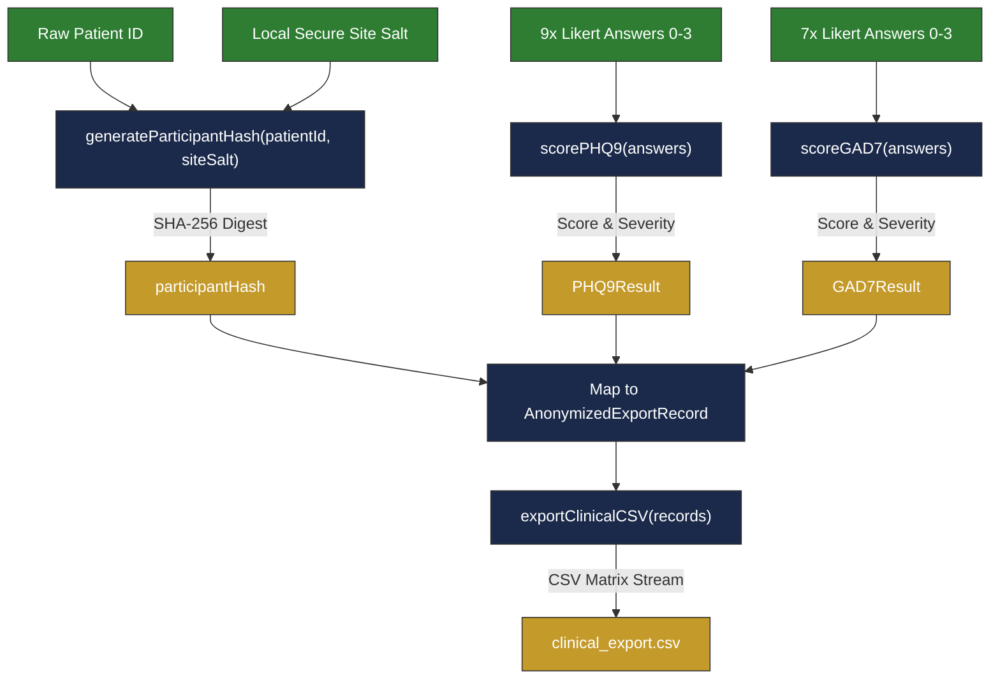
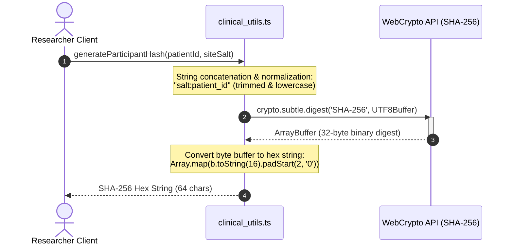
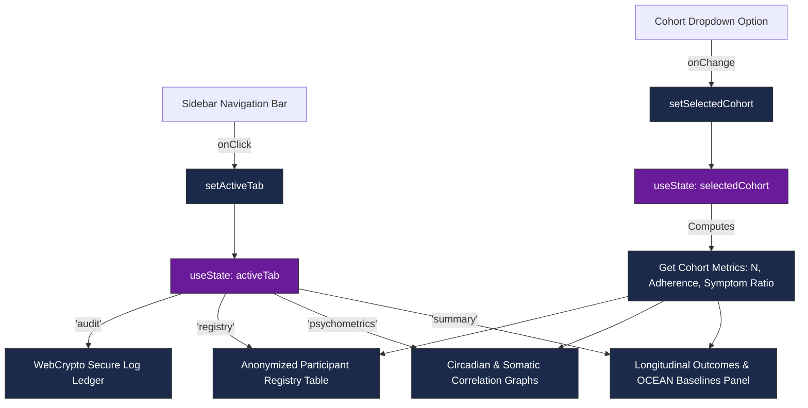

# AETHER_CLINICAL — Technical Architecture
> Secure Clinical Research Utilities & Psychometric Dashboard

This document provides a technical walkthrough of the **AETHER_CLINICAL** prototype system, mapping the TypeScript schemas, processing pipelines, and React component states.

---

## 1. Data Model (TypeScript Schemas)
The psychometric scoring logic, de-identification buffers, and export schemas are strongly typed in [`prototype/clinical_utils.ts`](file:///c:/Users/aryan/OneDrive/Documents/Visual%20Studio%202022/AIGGPA_Report/prototype/clinical_utils.ts).

```mermaid
classClass Diagram
classDef type font-family:var(--font-mono),fill:#1b2a4a,stroke:#c49a2a,stroke-width:1px,color:#fff;
classDef interface font-family:var(--font-mono),fill:#00695c,stroke:#00695c,stroke-width:1px,color:#fff;

class PHQ9Result {
    <<interface>>
    +number score
    +PHQ9Severity severity
    +string colorCode
}

class GAD7Result {
    <<interface>>
    +number score
    +GAD7Severity severity
    +string colorCode
}

class AnonymizedExportRecord {
    <<interface>>
    +string participantHash
    +string ageCohort
    +string studyCohort
    +number baselinePHQ9
    +number baselineGAD7
    +number activePHQ9
    +number activeGAD7
    +number adherencePercentage
    +number sleepAverageHours
}

class PHQ9Severity {
    <<type>>
    'Minimal' | 'Mild' | 'Moderate' | 'Moderately Severe' | 'Severe'
}

class GAD7Severity {
    <<type>>
    'Minimal' | 'Mild' | 'Moderate' | 'Severe'
}

PHQ9Result --> PHQ9Severity
GAD7Result --> GAD7Severity
```

---

## 2. Ingestion & scoring pipeline (Data Flow)
The workflow follows a **Zero-Knowledge / Zero PHI** protocol. Personal Health Information (PHI) is hashed on the client side before any clinical scoring or aggregation occur.



---

## 3. Client-Side Cryptographic Anonymization (Sequence)
To prevent dictionary attacks on de-identified database records, client nodes use the asynchronous browser WebCrypto API to salt and hash participant identities.



---

## 4. UI Rendering & Component State (React)
The main dashboard [`prototype/ClinicalDashboard.tsx`](file:///c:/Users/aryan/OneDrive/Documents/Visual%20Studio%202022/AIGGPA_Report/prototype/ClinicalDashboard.tsx) coordinates active tabs and filters using standard React hooks.


